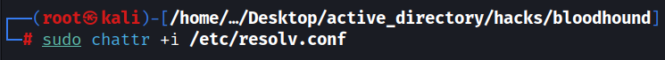

# BloodHound Active Directory Reconnaissance Project

## Overview

This project demonstrates the successful implementation of BloodHound for Active Directory reconnaissance and analysis of the domain `sohamjadhav.in`. BloodHound was used to collect, visualize, and analyze the relationships between various Active Directory objects to identify potential attack paths and security vulnerabilities.

___

## Project Components

### Tools Used
- **BloodHound** - A security tool used to visualize and analyze Active Directory environments
- **Bloodhound-python** - Python-based ingestor for BloodHound

### Environment
- Domain: `sohamjadhav.in`
- Domain Controller: `dc1.sohamjadhav.in`
- Operating System: Kali Linux (for running BloodHound)

---

## Installation

The installation was performed following the official BloodHound Community Edition Quickstart guide from [https://bloodhound.specterops.io/get-started/quickstart/community-edition-quickstart](https://bloodhound.specterops.io/get-started/quickstart/community-edition-quickstart).

### Key Installation Steps:

1. **Install Neo4j Database**:
   - Download and install Neo4j
   - Configure database credentials
   - Start the Neo4j service

2. **Install BloodHound**:
   - Download the BloodHound application
   - Install required dependencies
   - Configure BloodHound to connect to the Neo4j database

3. **Install BloodHound Python Ingestor**:
   ```bash
   pip install bloodhound
   ```

---

## Implementation Steps

### 1. DNS Configuration

Before running BloodHound, it was necessary to configure DNS resolution to properly resolve the domain controller. This step is crucial as BloodHound will fail to connect to the domain controller without proper name resolution:

```bash
sudo nano /etc/resolv.conf
```

This command removes the immutable attribute from /etc/resolv.conf:


This allows modifications to the file, enabling you to edit or update DNS resolver settings.

This command adds the immutable attribute back to /etc/resolv.conf using:



This prevents any changes to the file, protecting it from being overwritten or altered—even by root or network managers.

Add the appropriate nameserver to resolve the domain controller:
```
nameserver <IP_OF_DOMAIN_CONTROLLER>
```

At first, when you'll open the `resolve.conf` file, it will look like this:


For me, removing the existing nameservers and adding my DC's nameserver worked:


Remember to change the namervers back after the activity.

> **Note**: Without this configuration, BloodHound-python will fail with DNS resolution errors when trying to connect to `dc1.sohamjadhav.in`.

---

### 2. Data Collection

Data was collected using the Bloodhound-python ingestor with the following command:

```bash
bloodhound-python -u rohandabir -p <password> --dc dc1.sohamjadhav.in --disable-autogc -d sohamjadhav.in -c all
```

Parameters used:
- `-u rohandabir`: Username for authentication
- `-p <password>`: Password for authentication
- `--dc dc1.sohamjadhav.in`: Domain controller to connect to
- `--disable-autogc`: Disable automatic garbage collection
- `-d sohamjadhav.in`: Target domain
- `-c all`: Collect all available information

---

### 3. Data Collection Results

The data collection process successfully gathered information about:
- 1 Active Directory domain (sohamjadhav.in)
- 3 computers
- 58 users
- 52 groups
- 2 GPOs
- 3 OUs
- 21 containers
- 0 trusts


The data was collected and stored in JSON format for analysis in the BloodHound GUI:
- `20250515082722_computers.json`
- `20250515082722_containers.json`
- `20250515082722_domains.json`
- `20250515082722_gpos.json`
- `20250515082722_groups.json`
- `20250515082722_ous.json`
- `20250515082722_users.json`

---

### 4. Analysis with BloodHound GUI

For BloodHound CE (BloodHound Community Edition)
BloodHound CE includes everything (API + frontend + database) and runs in Docker containers. Here's how you can start it at localhost:8080:

Launch BloodHound using Docker Compose
```
sudo docker-compose up -d
```
By default, the web interface will be available at:

```
http://localhost:8080
```

🔑 Default credentials:

Username: `neo4j`
Password: `BloodHound`

The login page must look like this:


To import the data, go to the file ingest section 

and upload the .json files that we earlier had captured.

After importing the collected data into the BloodHound GUI, several important observations were made:

#### Member Analysis


#### User Account Analysis
- User: `ROHANDABIR@SOHAMJADHAV.IN`
  - Distinguished Name: `CN=ROHAN RD. DABIR,OU=PURCHASE,DC=SOHAMJADHAV,DC=IN`
  - Last Logon: 2025-05-15 08:27 EDT (GMT-0400)
  - Last Logon (Replicated): 2025-05-10 23:46 EDT (GMT-0400)
  - Password Last Set: 2025-05-10 23:46 EDT (GMT-0400)
  - Password Never Expires: FALSE
  - Password Not Required: FALSE
  - SAM Account Name: rohandabir
  - Home Directory: `\\dc1\Data\rohandabir`
  - User is a member of:
    - DOMAIN USERS@SOHAMJADHAV.IN
    - ADMINISTRATORS@SOHAMJADHAV.IN
    - USERS@SOHAMJADHAV.IN
   


#### Group Membership Analysis
- Group: `ADMINISTRATORS@SOHAMJADHAV.IN`
  - Members (4):
    - ROHANDABIR@SOHAMJADHAV.IN
    - ADMINISTRATOR@SOHAMJADHAV.IN
    - ENTERPRISE ADMINS@SOHAMJADHAV.IN
    - DOMAIN ADMINS@SOHAMJADHAV.IN


#### Domain Users
- Example User: `BJACKSON@SOHAMJADHAV.IN`
  - Distinguished Name: `CN=BOB JACKSON,OU=SALES,DC=SOHAMJADHAV,DC=IN`
  - Created: 2025-05-13 11:17 EDT (GMT-0400)
  - No login history recorded (Last Logon: UNKNOWN, Last Logon (Replicated): NEVER)

#### Operating System Info of my Domain Controller(DC)


---

This project demonstrated the effective use of BloodHound for Active Directory reconnaissance on the domain sohamjadhav.in. From DNS configuration to data collection and analysis, we successfully mapped relationships, identified privileged accounts, and visualized the domain structure.

This sets the stage for deeper analysis of attack paths and security improvements.

Onward to the next phase. 

Over n Out.
